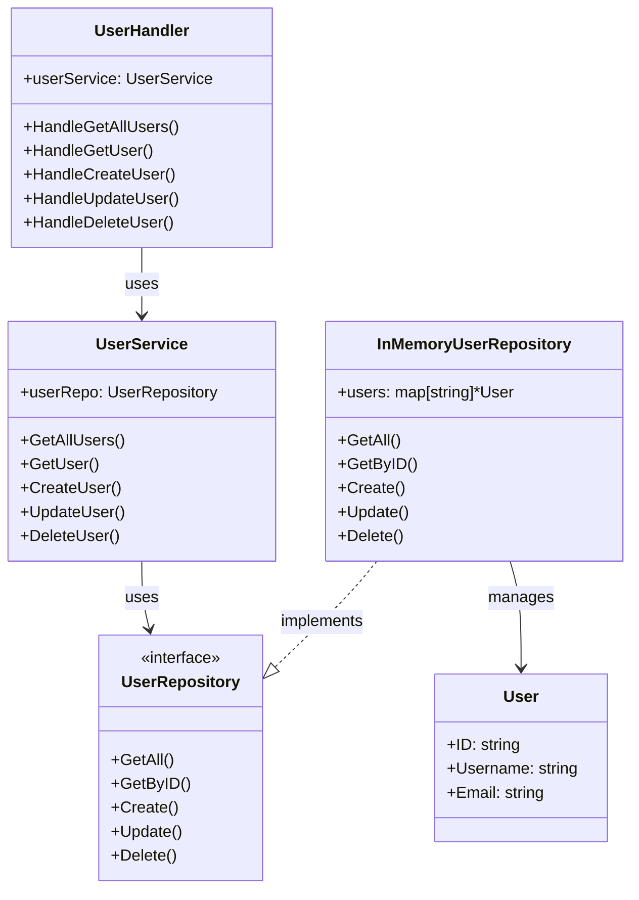
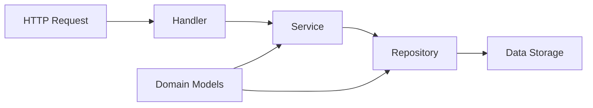
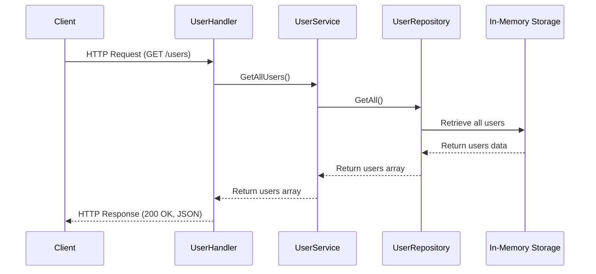
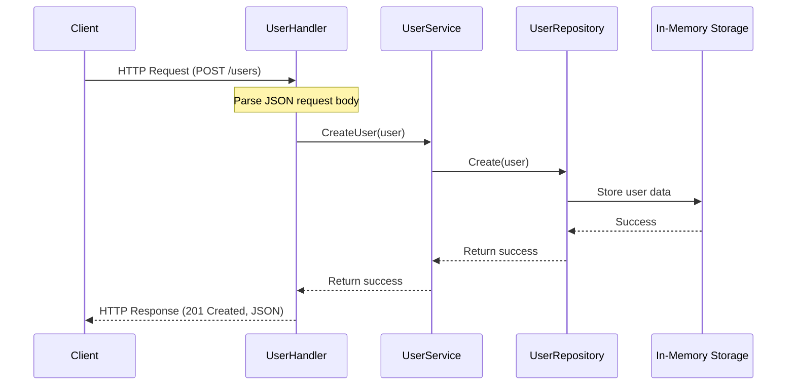
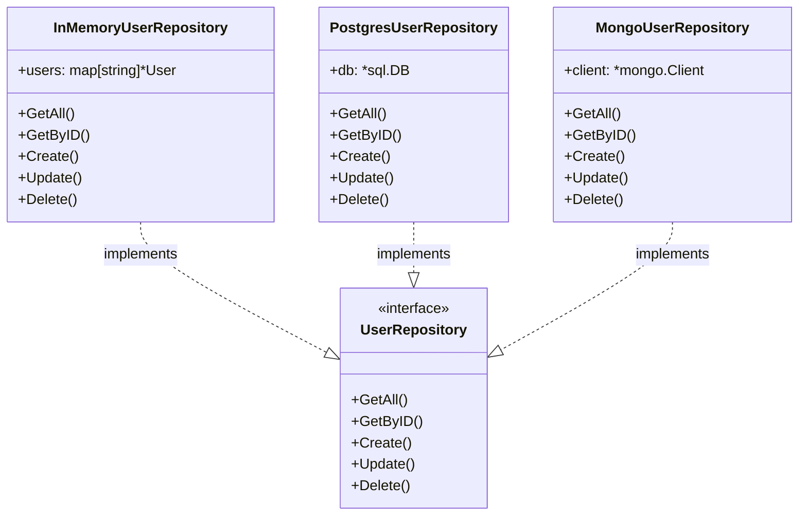
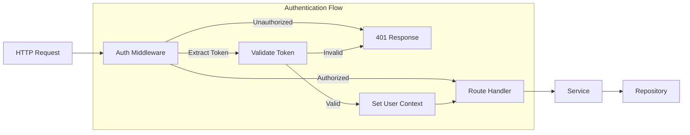

# Go FastHTTP Example

A high-performance RESTful API server example built with Go and FastHTTP. This project demonstrates how to build a scalable web service using the FastHTTP framework, implementing clean architecture principles with proper separation of concerns.

## Features

- High-performance HTTP server using FastHTTP (significantly faster than net/http)
- Clean architecture with proper separation of concerns (domain, service, repository, handler)
- RESTful API endpoints for user management (CRUD operations)
- In-memory repository implementation (easily replaceable with a database implementation)
- Comprehensive Makefile for common development tasks
- API documentation with OpenAPI/Swagger
- Testable code with dependency injection

## Prerequisites

- Go 1.21 or higher
- Make (optional, for using Makefile commands)

## Installation

1. Clone the repository:
   ```bash
   git clone https://github.com/captain-corgi/go-fasthttp-example.git
   cd go-fasthttp-example
   ```

2. Install dependencies:
   ```bash
   go mod download
   ```

## Usage

### Running the Application

The project includes a Makefile with common development commands:

```bash
# Build the application
make build

# Run the application
make run

# Run tests
make test

# Run linter
make lint

# Clean build artifacts
make clean

# Run go mod tidy and vendor
make tidy
```

Alternatively, you can run the server directly:

```bash
go run cmd/server/main.go
```

By default, the server starts on port 8080. You can specify a different port using the `-port` flag:

```bash
go run cmd/server/main.go -port 3000
```

### Testing

The project includes unit tests for the service layer. To run the tests:

```bash
make test
```

Or directly with Go:

```bash
go test ./...
```

### Development Workflow

1. Make changes to the codebase
2. Run tests to ensure functionality: `make test`
3. Run linter to ensure code quality: `make lint`
4. Build and run the application: `make run`
5. Test the API endpoints using curl or a tool like Postman

### Adding New Features

When adding new features, follow these steps:

1. Define the model in the domain layer if needed
2. Add repository methods in the repository interface and implementation
3. Add service methods in the service layer
4. Add handler methods in the handler layer
5. Register new routes in the main.go file
6. Update the API documentation in swagger.yaml
7. Write tests for the new functionality

## API Endpoints

### User Management

- **GET /users**
  - Retrieves all users
  - Response: 200 OK (with array of user data)
  - Example: `curl -X GET http://localhost:8080/users`

- **GET /users/{id}**
  - Retrieves a user by ID
  - Response: 200 OK (with user data) or 404 Not Found
  - Example: `curl -X GET http://localhost:8080/users/1`

- **POST /users**
  - Creates a new user
  - Request body: JSON user object
  - Response: 201 Created (with created user data)
  - Example:
    ```bash
    curl -X POST -H "Content-Type: application/json" \
      -d '{"id":"1", "username":"john_doe", "email":"john@example.com"}' \
      http://localhost:8080/users
    ```

- **PUT /users/{id}**
  - Updates an existing user
  - Request body: JSON user object
  - Response: 200 OK (with updated user data)
  - Example:
    ```bash
    curl -X PUT -H "Content-Type: application/json" \
      -d '{"username":"john_updated", "email":"john.updated@example.com"}' \
      http://localhost:8080/users/1
    ```

- **DELETE /users/{id}**
  - Deletes a user
  - Response: 204 No Content
  - Example: `curl -X DELETE http://localhost:8080/users/1`

### API Documentation

The API is documented using OpenAPI/Swagger. You can find the full specification in the `api/swagger.yaml` file.

## Architecture

This project follows the clean architecture pattern with clear separation of concerns:

### Layers

1. **Domain Layer** - Contains the core business models and repository interfaces
2. **Repository Layer** - Implements data access logic (currently using in-memory storage)
3. **Service Layer** - Implements business logic and orchestrates repository operations
4. **Handler Layer** - Handles HTTP requests and responses, converts between HTTP and domain models

### Component Architecture



### Dependency Flow



## Project Structure

```
.
├── api/
│   └── swagger.yaml     # OpenAPI/Swagger documentation
├── cmd/
│   └── server/          # Application entry point
├── internal/
│   ├── domain/          # Domain models and interfaces
│   │   ├── model/       # Business entities
│   │   └── repository/  # Repository interfaces and implementations
│   │       └── mocks/   # Mock implementations for testing
│   ├── handler/         # HTTP request handlers
│   └── service/         # Business logic layer
├── Makefile             # Build and development commands
└── README.md            # Project documentation
```

## Code Organization

- **User Model** (`internal/domain/model/user.go`): Defines the User entity
- **User Repository** (`internal/domain/repository/user_repository.go`): Defines the repository interface and in-memory implementation
- **User Service** (`internal/service/user_service.go`): Implements business logic for user operations
- **User Handler** (`internal/handler/user_handler.go`): Handles HTTP requests for user operations
- **Main** (`cmd/server/main.go`): Application entry point, wires dependencies and sets up routes

## Request Flow

### API Request Lifecycle



### Create User Flow



## Performance Considerations

FastHTTP is designed to be significantly faster than the standard net/http package in Go. Some key performance benefits include:

- Reduced memory allocations
- Connection reuse
- Optimized for high-concurrency scenarios
- Lower CPU and memory usage under high load

## Extending the Project

### Adding Database Support

To replace the in-memory repository with a database implementation:

1. Create a new repository implementation (e.g., `PostgresUserRepository`)
2. Implement the `UserRepository` interface methods using your database driver
3. Update the dependency injection in `main.go` to use your new repository



Example code for database implementation:

```go
// Initialize dependencies
dbConn := initDatabase() // Your database connection function
userRepo := repository.NewPostgresUserRepository(dbConn)
userService := service.NewUserService(userRepo)
userHandler := handler.NewUserHandler(userService)
```

### Adding Authentication

To add authentication:

1. Create middleware for authentication in a new package
2. Apply the middleware to protected routes in `main.go`
3. Update handlers to access authenticated user information



Example middleware implementation:

```go
func AuthMiddleware(next fasthttp.RequestHandler) fasthttp.RequestHandler {
    return func(ctx *fasthttp.RequestCtx) {
        // Extract token from Authorization header
        token := ctx.Request.Header.Peek("Authorization")

        // Validate token
        if !isValidToken(token) {
            ctx.SetStatusCode(fasthttp.StatusUnauthorized)
            return
        }

        // Set user info in context
        userID := extractUserIDFromToken(token)
        ctx.SetUserValue("userID", userID)

        // Call the next handler
        next(ctx)
    }
}

// In main.go
r.GET("/users", authMiddleware(userHandler.HandleGetAllUsers))
```

## Contributing

Contributions are welcome! Please feel free to submit a Pull Request.

When contributing, please:

1. Fork the repository
2. Create a feature branch (`git checkout -b feature/amazing-feature`)
3. Commit your changes (`git commit -m 'Add some amazing feature'`)
4. Push to the branch (`git push origin feature/amazing-feature`)
5. Open a Pull Request

## License

This project is licensed under the MIT License - see the LICENSE file for details.